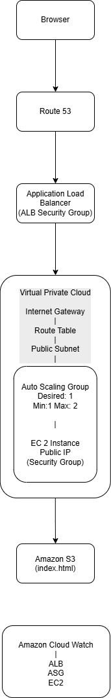

# AWS-WebsiteHosting-Portfolio
Portfolio project for demonstrating scalable AWS web infrastructure with VPC, EC2, ALB, S3, Auto Scaling group, IAM and Monitoring. The project highlights **best practices** for deploying and monitoring web applications using AWS Free Tier.
---
## AWS Services Used
- **VPC**: Subnets, Routing, Internet Gateway 
- **EC2**: Web server hosting static content
- **Application Load Balancer (ALB)**: Distributes traffic to EC2 instances
- **Auto Scaling Group (ASG)**: Ensures availability and scalability 
- **S3**: Stores static website content (`index.html`)
- **IAM Roles**: Secure access from EC2 to S3
- **Route 53**: DNS configuration for testing (domain not registered)
- **CloudWatch**: Metrics and alarms for EC2 and ALB monitoring  
---
## Architecture Diagram 

## Implementation Steps
### 1. VPC and Networking- Created a **custom VPC** with public subnets  - Configured routing tables and Internet Gateway for public access  

### 2. S3 Bucket- Created an S3 bucket to store `index.html`  - Enabled public access for testing purposes  
### 3. EC2 Instance- Launched EC2 in public subnet  - Installed Nginx  - Pulled static content from S3 using IAM role  
'''bash
aws s3 cp s3://webpage1-s3bucket/Portfolio/index.html /var/www/html/index.html '''
### 4. Application Load Balancer- Created an internet-facing ALB in public subnets. Registered EC2 in Target Group. Configured health checks for EC2 targets 
### 5. Auto Scaling Group- Configured minimum 1, maximum 2 instances. Attached to ALB Target Group
### 6. Route 53 (DNS – Testing Only)- Created Public Hosted ZoneAdded A record (Alias → ALB). Domain not registered → ALB DNS used for testing
### 7. CloudWatch Monitoring- Enabled EC2 metrics (CPU, Network)Enabled ALB metrics (HealthyHostCount, RequestCount, TargetResponseTime)Created alarms:EC2 CPU > 70%ALB target unhealthyEnabled ALB access logs to S3

